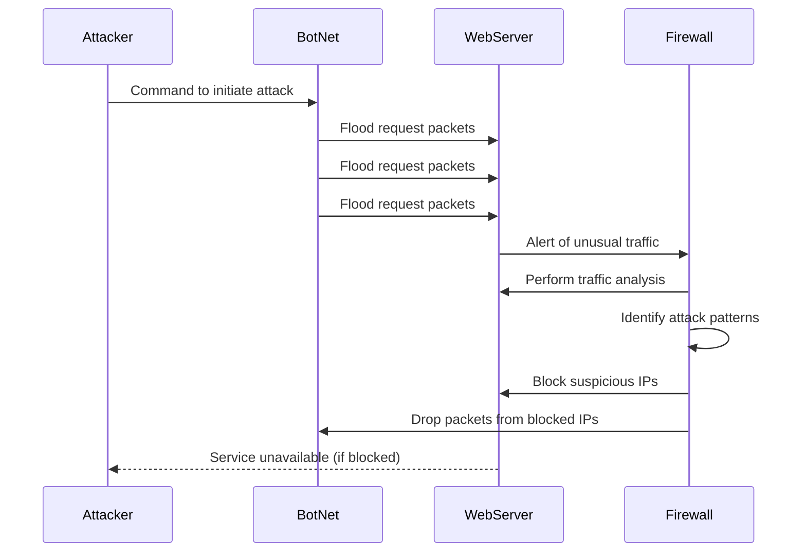

## Documentation

Attacker -> BotNet: Command to initiate attack

The attacker instructs the botnet (a network of compromised devices) to start the DDoS attack, specifying the target server’s IP and attack parameters.
BotNet -> WebServer: Flood request packets

The botnet sends a massive volume of request packets to overwhelm the web server, making it unable to process legitimate traffic through methods like SYN floods or UDP floods.
BotNet -> WebServer: Flood request packets (repeated)

The botnet continues to send repeated flood packets, demonstrating the persistent nature of DDoS attacks until the attacker stops or the server fails.
WebServer -> Firewall: Alert of unusual traffic

The web server detects the overwhelming requests and alerts the firewall to trigger defensive measures.
Firewall -> WebServer: Perform traffic analysis

The firewall analyzes incoming traffic to assess its legitimacy, differentiating between normal and attack traffic.
Firewall -> Firewall: Identify attack patterns

The firewall identifies DDoS attack patterns, such as high request volumes from specific IP ranges, to formulate a response.
Firewall -> WebServer: Block suspicious IPs

The firewall blocks traffic from suspicious IP addresses identified during the analysis to protect the web server from further overload.
Firewall -> BotNet: Drop packets from blocked IPs

The firewall drops packets from blocked IPs, preventing the botnet from sending more requests and mitigating the attack’s impact.
WebServer -->> Attacker: Service unavailable (if blocked)

If the server is overwhelmed, it may respond with "Service Unavailable," indicating it cannot handle requests due to the DDoS attack or defenses in place.