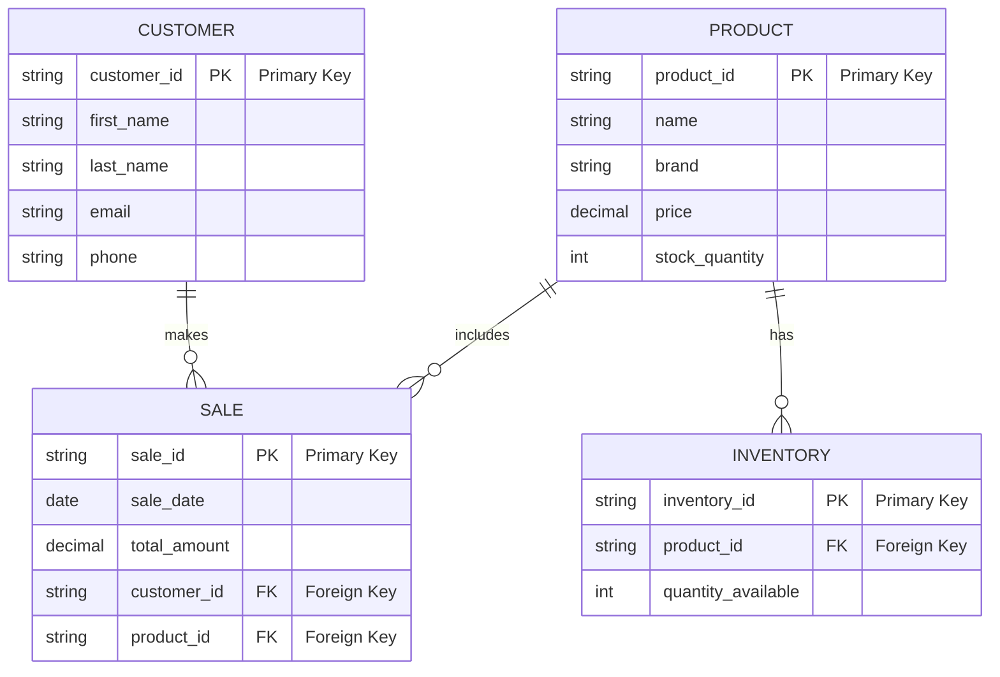

Documentation
1. Product
Description: Represents the shoes available for sale in the store.
Attributes:
product_id (PK): Unique identifier for each product.
name: The name of the product.
brand: The brand associated with the product.
price: The selling price of the product.
stock_quantity: Total number of units available in stock.
2. Customer
Description: Represents customers who purchase products from the store.
Attributes:
customer_id (PK): Unique identifier for each customer.
first_name: Customer's first name.
last_name: Customer's last name.
email: Customer's email address.
phone: Customer's phone number.
3. Sale
Description: Represents sales transactions occurring in the store.
Attributes:
sale_id (PK): Unique identifier for each sale.
sale_date: The date when the sale occurred.
total_amount: The total amount charged for the sale.
customer_id (FK): Reference to the customer who made the purchase.
product_id (FK): Reference to the product sold in the transaction.
4. Inventory
Description: Represents the inventory details for products.
Attributes:
inventory_id (PK): Unique identifier for inventory records.
product_id (FK): Reference to the product in the inventory.
quantity_available: Quantity of the product currently available in inventory.
Relationships
Customer to Sale (1 to Many):
A customer can make multiple purchases (sales), but each sale is associated with one specific customer.
Product to Sale (1 to Many):
A product can be sold in multiple transactions (sales), but each sale involves one specific product.
Product to Inventory (1 to Many):
A product can have multiple records in inventory (for example, different locations or batches), but each inventory record corresponds to one specific product.